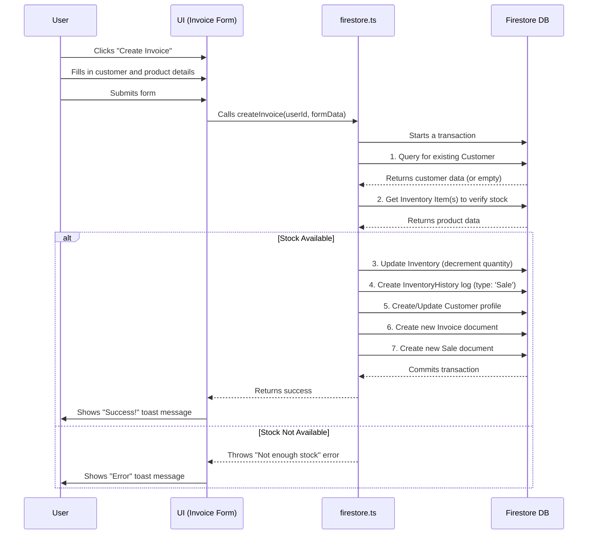

# BizBalance App: Architecture & Functional Specification

This document provides a detailed overview of the BizBalance application's architecture, including its pages, components, data models, services, and user workflows.

---

## 1. High-Level Architecture

BizBalance is a **Next.js Progressive Web App (PWA)** using the App Router. It follows a server-first approach, with most components being Server Components by default. Client Components (`'use client'`) are used for interactivity.

-   **Frontend**: Next.js, React, Tailwind CSS, ShadCN UI
-   **Backend (BaaS)**: Firebase
    -   **Database**: Firestore for real-time data storage.
    -   **Authentication**: Firebase Authentication for user sign-in (Email/Password & Google).
    -   **Storage**: Firebase Storage for file uploads (e.g., business logos).
-   **Styling**: A combination of ShadCN UI components and Tailwind CSS utility classes. The theme is defined in `src/app/globals.css`.

---

## 2. Core Data Models (Firestore)

All user-specific data is stored under the path `/users/{userId}/`.

| Entity | Collection Path | Description | Key Properties |
| :--- | :--- | :--- | :--- |
| **Business Profile** | `/users/{userId}/profile/business` | Stores the user's business details for branding invoices. | `businessName`, `logoUrl`, `email`, `phone`, `address`, `accounts` (array) |
| **Customer** | `/users/{userId}/customers` | Stores customer information, automatically created/updated from invoices. | `name`, `phone`, `address`, `totalSpent`, `amountPaid`, `amountOwed` |
| **Invoice** | `/users/{userId}/invoices` | Represents a single invoice issued to a customer. | `invoiceNumber`, `customerName`, `customerId`, `issueDate`, `dueDate`, `status`, `amount`, `amountPaid`, `lineItems` (array) |
| **Expense** | `/users/{userId}/expenses` | Records a single business expense. | `description`, `amount`, `category`, `date` |
| **Inventory Item** | `/users/{userId}/inventory` | Represents a single product or SKU in the inventory. | `name`, `sku`, `quantity`, `unitCost`, `reorderLevel`, `category` |
| **Inventory History** | `/users/{userId}/inventoryHistory` | Logs all changes to inventory stock levels for auditing. | `itemId`, `itemName`, `date`, `type` (`Creation`, `Sale`, `Adjustment`, `Deleted`), `change`, `newQuantity`, `details` |
| **Sale** | `/users/{userId}/sales` | Records the sale of a specific product line item for reporting. | `productId`, `productName`, `quantity`, `unitPrice`, `date` |
| **Subscription** | `/users/{userId}/subscriptions` | Stores push notification subscription objects for a user's devices. | `endpoint`, `keys` (p256dh, auth) |

---

## 3. Page Wireframes & Functionality

This section details each page of the application.

### 3.1. Dashboard (`/`) - DETAILED SPECIFICATION

**1. Page Name and Purpose:**
- **Name**: Dashboard
- **Path**: `/`
- **Purpose**: To provide the primary user (Business Owner) with a real-time, high-level, and actionable overview of their business's financial and operational health immediately upon logging in. It aggregates key metrics and surfaces urgent information to guide decision-making.

**2. What the User Sees:**
Upon landing, the user sees a full-page layout dominated by a series of "cards" and charts. A loading state, consisting of `Skeleton` components matching the layout of the cards and charts, is visible for 1-3 seconds while data is fetched. Once loaded, the cards populate with numerical data and the charts render with visual information. The overall impression is a dense but organized summary of business activities.

**3. UI Elements & Functionality:**

**Page-Level Elements:**
-   **H1 Title**: "Dashboard"
    -   **What it does**: Provides the main title for the page.
-   **Subtitle Paragraph**: "Your financial overview and business insights."
    -   **What it does**: Describes the page's purpose.

**Stat Cards (Grid of 4):**
-   **Card 1: Total Revenue**
    -   **Icon**: `₦` (Naira symbol)
    -   **Title**: "Total Revenue"
    -   **Value Display**: A large, bold currency figure (e.g., `₦1,250,300.00`).
    -   **Description**: "Based on paid invoices"
    -   **Data Read**: Reads all documents from `/users/{userId}/invoices`. It filters for documents where `status === 'Paid'` and sums the `amountPaid` or `amount` fields for each.
-   **Card 2: Total Expenses**
    -   **Icon**: `CreditCard`
    -   **Title**: "Total Expenses"
    -   **Value Display**: A large, bold currency figure (e.g., `₦450,100.00`).
    -   **Description**: "Total recorded expenses"
    -   **Data Read**: Reads all documents from `/users/{userId}/expenses` and sums the `amount` field.
-   **Card 3: Net Profit**
    -   **Icon**: `ArrowUpRight` (if profit is positive/zero) or `ArrowDownLeft` (if profit is negative).
    -   **Title**: "Net Profit"
    -   **Value Display**: A large, bold currency figure (e.g., `₦800,200.00`). The color is red if negative.
    -   **Description**: "Revenue minus expenses"
    -   **Data Read**: Calculated field: `Total Revenue` - `Total Expenses`.
-   **Card 4: Profit Margin**
    -   **Icon**: `LineChartIcon`
    -   **Title**: "Profit Margin"
    -   **Value Display**: A large, bold percentage (e.g., `64.00%`). The color is red if negative.
    -   **Description**: "Net profit / total revenue"
    -   **Data Read**: Calculated field: `(Net Profit / Total Revenue) * 100`.
    -   **Validation**: If Total Revenue is 0, this value defaults to `0.00%` to prevent division-by-zero errors.

**Main Content (Grid):**
-   **Component: Cash Flow Overview Chart** (`BarChart`)
    -   **UI Elements**: A responsive bar chart with X and Y axes, a grid, and tooltips.
    -   **Title**: "Cash Flow Overview"
    -   **Description**: "A summary of your income and expenses over time."
    -   **What it does**: Visually represents total income vs. total expenses for the last 6 months.
    -   **Interaction**: Hovering over a bar group reveals a `RechartsTooltip` showing the exact "Income" and "Expenses" figures for that month.
    -   **Data Read**: Aggregates data from `invoices` (where `status === 'Paid'`) and `expenses`, grouping them by month. The backend function `getDashboardData` (which calls `getMonthlyBreakdown`) prepares this array of `{ name: 'Month', income: number, expenses: number }`.
-   **Component: Inventory Snapshot Card**
    -   **UI Elements**: A card with labeled values and separators.
    -   **Title**: "Inventory Snapshot"
    -   **Fields**:
        -   "Total Items in Stock": A formatted number (e.g., `1,234`).
        -   "Total Stock Value": A currency figure (e.g., `₦5,678,900.00`).
        -   "Outstanding Invoices": A currency figure.
    -   **Data Read**:
        -   Items in Stock: Sums the `quantity` field for all documents in `/users/{userId}/inventory`.
        -   Stock Value: Calculates `SUM(item.quantity * item.unitCost)` for all items in `/users/{userId}/inventory`.
        -   Outstanding: Sums `amount - amountPaid` for all invoices where `status` is 'Pending' or 'Overdue'.
-   **Component: Recent Transactions Card** (`recent-transactions-card.tsx`)
    -   **UI Elements**: A list of recent financial activities, each with a description, amount, date, and type badge.
    -   **Title**: "Recent Transactions"
    -   **Description**: "Your latest 5 financial activities."
    -   **Button**: "View All Transactions"
        -   **Action**: Navigates the user to the `/transactions` page.
    -   **Data Read**: Fetches the 5 most recent transactions by calling `getRecentTransactions`, which consolidates data from `invoices` (for income) and `expenses`. Each item shows a description, amount (`+` for income, `-` for expense), date, and a styled badge ('Income' or 'Expense').
-   **Component: Items to Restock Card**
    -   **UI Elements**: A list of products with their remaining quantity.
    -   **Icon**: `PackageX` (destructive color)
    -   **Title**: "Items to Restock"
    -   **Description**: "Products that are low on stock or finished."
    -   **Data Read**: Reads all documents from `/users/{userId}/inventory` and filters for items where `quantity <= reorderLevel`. Displays the `name` and `quantity` for each.
    -   **Empty State**: If no items are low on stock, it displays a positive message like "All items are well-stocked!" with a green `Package` icon.
-   **Component Series: Top Lists (3 Cards)**
    -   **Cards**: "Best Sellers", "Top Customers", "Top Debtors"
    -   **UI Elements**: Each card contains a table-like list with a name and a value. On mobile, this is a series of stacked cards; on desktop, it's a `Table`.
    -   **Data Read**:
        -   **Best Sellers**: Aggregates data from `/users/{userId}/sales` to find the top 5 products by `SUM(quantity)`.
        -   **Top Customers**: Reads `/users/{userId}/customers` and sorts by `totalSpent` descending.
        -   **Top Debtors**: Reads `/users/{userId}/customers`, filters for `amountOwed > 0`, and sorts by `amountOwed` descending.

**4. Error and Success States:**
-   **Success State**: All cards and charts are populated with data. The page is interactive. This is the default operational state.
-   **Loading State**: On initial load or data refresh, all data-driven elements (values, charts) are replaced by `Skeleton` components. This prevents layout shift and indicates activity. Buttons are typically disabled during this state.
-   **Error States**:
    -   **Partial Data Failure**: If one data fetch fails (e.g., `getBestSellers`), the corresponding card will show an error message (e.g., "Could not load best sellers.") or an empty state ("No data yet."), while other cards render normally.
    -   **Total Data Failure**: If the main `getDashboardData` call fails, all cards will show '0' or 'N/A' and the charts will display an "No data to display" message. A `Toast` notification may appear stating, "Could not load dashboard data. Please try refreshing."
-   **Validation**: Data validation occurs on the backend during data aggregation. For example, `profitMargin` calculation handles the division-by-zero case.

**5. Page Connectivity:**
-   Clicking the "View All Transactions" button navigates the user to `/transactions`.
-   Although not explicitly linked, clicking on any of the "Top Customer" or "Top Debtor" entries would be a logical future enhancement to navigate to a customer details page (e.g., `/customers/{customerId}`).
-   Clicking on an item in "Items to Restock" could navigate to the specific item's detail page (`/inventory/{itemId}`).

**6. User Roles and Access:**
-   **Access**: This page is accessible to any authenticated user. In a future multi-user system, this page would likely be restricted to roles with financial oversight, such as `Admin` or `Owner`. A `Salesperson` might see a limited version with only their sales metrics. The current implementation does not have role-based access control; any logged-in user can see all data for their `userId`.

**7. Backend Logic Triggered:**
-   **On Page Load**: The primary user action is simply loading the page. This triggers the `useEffect` hook in `src/app/page.tsx`, which executes the `getDashboardData(user.uid)` function from `src/lib/firestore.ts`.
-   **`getDashboardData` Logic**: This is a significant backend process. It performs multiple parallel Firestore queries to fetch invoices, expenses, inventory, and customers. It then performs a series of aggregations and calculations in JavaScript (e.g., summing revenues, calculating profit margins, identifying top sellers) before returning a single, consolidated `DashboardData` object to the client component.

**8. Permissions and Security:**
-   **Firestore Security Rules**: All data fetches are governed by `firestore.rules`. The rule `allow read, write: if request.auth.uid == userId;` under the `match /users/{userId}/{document=**}` path is critical. It ensures that a user can ONLY read data from their own sub-collections (e.g., `/users/USER_A/invoices`). An attempt by `USER_A` to fetch data for `USER_B` would be blocked by Firestore, resulting in a permission-denied error on the client.

**9. Behavior for First-Time vs. Returning Users:**
-   **First-Time User**: A brand new user will see a dashboard where every single value is `0` or `0.00%`, and all lists ("Recent Transactions", "Best Sellers", etc.) are empty. This can be an intimidating "empty state."
    -   **Opportunity for Improvement**: The page should detect this zero-data state and display a "Welcome" component or guided tour. This component would suggest the next logical steps, such as "Let's set up your business profile" or "Create your first invoice to get started," with direct links to `/settings` or the `AddInvoiceForm` dialog.
-   **Returning User**: A returning user will see a dashboard populated with their business data, reflecting all their activity since their last visit. The charts will show trends, and the lists will contain their most recent and relevant information. This provides immediate value and a clear snapshot of their business's current status.

---
### 3.2. Authentication (`/login`)
-   **File**: `src/app/login/page.tsx`
-   **Purpose**: Allows users to sign in or sign up.
-   **Functionality**:
    -   Tabs for "Sign In" and "Sign Up".
    -   Sign in with email and password.
    -   Sign up with email and password (with confirmation).
    -   Sign in with Google OAuth.
    -   "Forgot Password?" link that opens a dialog to send a password reset email.
-   **Data Interaction**: Uses `signInWith...` and `signUpWith...` functions from `src/lib/auth.ts`.

### 3.3. Customers (`/customers`)
-   **File**: `src/app/customers/page.tsx`
-   **Purpose**: To view and manage the customer database.
-   **Functionality**:
    -   Displays a list of all customers in a table (desktop) and cards (mobile).
    -   Each customer entry shows name, contact info, total cost, amount paid, and balance.
    -   Search bar to filter customers by name, company, phone, or address.
    -   Clicking a customer navigates to their (future) details page.
-   **Data Interaction**: Fetches data from `getCustomers()`.

### 3.4. Invoices (`/invoices`)
-   **File**: `src/app/invoices/page.tsx`
-   **Purpose**: To create, manage, and track all invoices.
-   **Functionality**:
    -   **"Create Invoice" Button**: Opens a dialog (`add-invoice-form.tsx`) to create a new invoice.
    -   **Invoice List**: Displays all invoices with customer name, invoice number, dates, amount, and status (`Paid`, `Pending`, `Overdue`).
    -   **Search**: Filters invoices by customer, number, or status.
    -   **Actions Menu**: Dropdown for each invoice to `View`, `Record Payment`, `Send Reminder`, or `Delete`.
-   **Data Interaction**: Fetches from `getInvoices()`, creates via `createInvoice()`.

### 3.5. Invoice Details (`/invoices/[id]`)
-   **File**: `src/app/invoices/[id]/page.tsx`
-   **Purpose**: To display a single, detailed invoice.
-   **Functionality**:
    -   Renders a professional invoice layout with business & customer details, line items, and totals.
    -   **"Download PDF" Button**: Generates and downloads a PDF version of the invoice, including a QR code for verification.
-   **Data Interaction**: Fetches from `getInvoiceById()`.

### 3.6. Expenses (`/expenses`)
-   **File**: `src/app/expenses/page.tsx`
-   **Purpose**: To record and manage all business expenses.
-   **Functionality**:
    -   **"Add Expense" Button**: Opens a dialog (`add-expense-form.tsx`) to record a new expense.
    -   **Expense List**: Displays all expenses with date, category, description, and amount.
    -   **Search**: Filters expenses by description or category.
    -   **Actions Menu**: Allows users to `Edit` or `Delete` an expense.
-   **Data Interaction**: Fetches from `getExpenses()`, creates via `recordExpense()`.

### 3.7. Inventory (`/inventory`)
-   **File**: `src/app/inventory/page.tsx`
-   **Purpose**: To manage the product catalog and stock levels.
-   **Functionality**:
    -   **"Add Product" Button**: Opens a dialog (`add-product-form.tsx`) to add a new item.
    -   **"View History" Button**: Navigates to the inventory history page.
    -   **Product List**: Displays all inventory items with name, category, SKU, cost, quantity, reorder level, and stock status (`In Stock`, `Low Stock`).
    -   **Search**: Filters products by name, SKU, or category.
    -   **Actions Menu**: Allows `Adjust Stock`, `Edit`, or `Delete`.
-   **Data Interaction**: Fetches from `getInventory()`, creates via `addInventoryItem()`.

### 3.8. Reports (`/reports`)
-   **File**: `src/app/reports/page.tsx`
-   **Purpose**: To provide visual financial reports.
-   **Functionality**:
    -   **Profit & Loss Tab**: A bar chart comparing income and expenses monthly.
    -   **Cash Flow Tab**: A line chart showing the flow of cash in and out over time.
-   **Data Interaction**: Fetches from `getReportsData()`.

### 3.9. Settings (`/settings`)
-   **File**: `src/app/settings/page.tsx`
-   **Purpose**: To manage user and business profiles.
-   **Functionality**:
    -   **Personal Profile**: Update user's display name.
    -   **Business Profile**: Update business name, logo, contact info, address, and bank account details (for invoices).
    -   **Notifications**: Enable or disable push notifications on the current device.
-   **Data Interaction**: Fetches from `getBusinessProfile()`, updates via `updateBusinessProfile()`.

---

## 4. Service Layer (`src/lib`)

This layer contains the core business logic and data access functions.

| File | Purpose | Key Functions |
| :--- | :--- | :--- |
| **`firestore.ts`** | Handles all CRUD operations with the Firestore database. | - `getCustomers()`, `getInvoices()`, `getExpenses()`, `getInventory()` - `createInvoice()`, `recordExpense()`, `addInventoryItem()` - `update...()`, `delete...()`, `adjustInventoryQuantity()` - `getDashboardData()`, `getReportsData()` |
| **`auth.ts`** | Manages user authentication flows with Firebase Auth. | - `signInWithGoogle()`, `signInWithEmailPassword()` - `signUpWithEmailPassword()` - `sendPasswordReset()` - `signOut()` |
| **`storage.ts`** | Handles file uploads to Firebase Storage via a server proxy. | `uploadFile()` |
| **`firebase-admin.ts`** | (Server-side only) Initializes the Firebase Admin SDK for backend tasks. | `getAdminAuth()`, `getAdminStorage()` |

---

## 5. Data Flow Diagram (Mermaid)

This diagram illustrates the flow of data for a key user journey: **Creating an Invoice**.

This architecture provides a robust, scalable, and real-time foundation for the BizBalance application.
